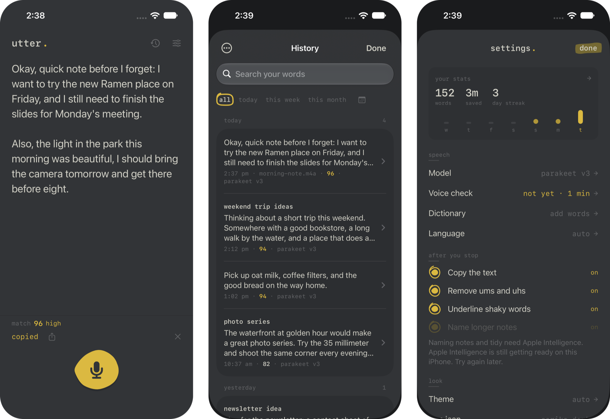

# utter.

Dictation for iPhone, built for long thoughts: monologues, voice notes, journaling, anything you'd rather say than type. Your voice is turned into text **on the phone**, with stronger speech models than built-in dictation, and nothing ever leaves it.

<p align="center">
  
</p>

**Free.** No price, no subscription, no account, no ads, no tracking, and I plan to keep it that way for as long as I can. Your recordings, notes, dictionary and stats stay on your own phone, and they're yours. The code is open: use it, change it, build on it. The speech models are free too (NVIDIA's Parakeet under CC-BY-4.0, OpenAI's Whisper under MIT), and the writing help uses Apple Intelligence, which is built into the phone.

Inspired by [SpeakType](https://github.com/karansinghgit/speaktype), the free dictation app for Mac, Windows and Linux. Themes come from [Monkeytype](https://github.com/monkeytypegame/monkeytype) by way of [Vox2](https://github.com/chrisqtruong/vox2). The hand-drawn marks come from [chrisqtruong.github.io](https://chrisqtruong.github.io).

## What it does

**Talking**
- **Tap to start, tap to stop.** One big marker-dot button, like Voice Memos. When you stop, the text is copied, ready to paste anywhere.
- **Long takes.** Up to 30 minutes per take. It keeps listening with the screen locked, and the last two minutes count down.
- **Action button.** One press opens Utter and starts listening; press again to stop. Back Tap works too.
- **Knows when nothing was said.** An accidental tap or silence comes back right away, without waking the model.

**Keyboard (early)**
- **A real keyboard, with a mic.** Add the Utter keyboard (Settings → General → Keyboard → Keyboards, then turn on Allow Full Access). It has full letters, numbers and symbols for quick fixes, built for speed: keys react on touch-down, the nearest key wins, a second finger finishes the first, and there's a letter popup, auto-capitals, double-space for a period, hold-to-delete (letters, then words) and hold-space to move the cursor. The mic sits in the bar above the keys.
- **Suggestions, on the phone.** Three suggestions as you type, small fixes on space ("teh" → "the"), your text replacements and contact names, and delete right after a fix to undo it. They come from Apple's built-in spell checker, so nothing is sent anywhere. No swipe typing or next-word prediction yet.
- **Dictate into any app.** Tap the mic: the first time, Utter opens and starts listening; go back and talk, then tap again and the text types itself in. For two minutes after that, the mic starts and stops right from the keyboard (the mic dot stays on meanwhile, since iOS only lets an app turn the mic on while it is on screen).
- **Go back to.** In Settings → Keyboard, pick the app you dictate into most (Notes, Messages, Slack…). After the keyboard opens Utter, it starts listening and jumps straight back there. iOS doesn't tell apps where you came from, so it's one fixed choice.
- **How:** iOS doesn't let keyboards use the microphone, so the app listens in a background session and passes the text back through a shared App Group file. The keyboard asks the app to start or stop, and only opens it if no session is running.

**Text**
- **Reads like notes.** Paragraphs start where you paused at the end of a sentence, and ums and uhs are removed.
- **Match score.** How sure the model was, 0 to 100, with shaky words underlined. See [how it works](docs/match-score.md).
- **Edit and undo.** Tap the text to fix a word. Undo steps back through every change, all the way to what you said.
- **Tidy.** One careful pass with Apple Intelligence, on the phone: fixes punctuation, splits run-on sentences, drops false starts.
- **Titles.** Longer notes get a short name, also from Apple Intelligence.
- **Dictionary.** "When it writes *vox two*, write *Vox2*." Fix one word in a note and Utter offers to remember it.

**Models**
- **Pick your model.** Parakeet v3 (fast and accurate; English and 24 European languages), Parakeet Mini (smallest), or Whisper Base, Small and Large v3 Turbo (99 languages). Each shows its pros and cons. Download only the ones you want, and remove them to free space.
- **Voice check.** Read a short passage and your names once. Utter shows which model hears you best, adds misheard names to your dictionary, and tunes the match score to your voice. See [how it works](docs/voice-check.md).

**Other sources**
- **Files.** Share a voice memo, recording or video to Utter from any app, or pick one (History → ••• → Transcribe a file). Up to an hour each.
- **What's playing.** Uses iOS screen recording to catch the sound of a video or podcast on the phone, then turns it into text when you come back (History → ••• → Transcribe what's playing). Protected streaming like Netflix or Apple Music comes through silent, and so do calls.

**Keeping it**
- **History.** Searchable by text and by date: today, this week, this month, or any day. Export any set as one Markdown file for Notes, Files or Obsidian.
- **Manage it.** Delete notes one at a time, several at once, or everything a search shows. Storage shows what takes room, and can keep notes for 30 days, 90 days, a year, or forever.
- **Stats.** Words, time saved versus typing, talking speed, streak, and the week at a glance.

**Look**
- **37 themes and 6 app icons**, a hand-drawn marker style throughout, and text that follows your iPhone's text size.

## Free and private

- **Free.** Utter costs nothing: no paid tier, no account, no ads. I'll keep it free for as long as I'm able to.
- **Your data stays yours.** Everything happens on the phone: speech becomes text there, and recordings are thrown away as soon as they're turned into text. Notes, the dictionary, stats and settings live only on your device; export or delete them any time. Nothing is collected or sent anywhere. The internet is only used to download speech models when you ask.
- **One exception, spelled out:** audio from "what's playing" is saved on the phone while it's captured (the screen recording add-on has too little memory to run a speech model), then deleted as soon as it's turned into text.
- **Open to build on.** The code is GPL-3.0: anyone can use it, study it, change it and share their own version, as long as what they share stays open too.

## Roadmap

- **Keyboard.** Long-press accents, a smoother first hand-off, and maybe next-word prediction with an on-device model.
- **Stronger on-device tidy.** Try an optional open model (downloaded like the speech models) for better cleanup, still on the phone.
- **A plain privacy panel** in the app and on the site.

## Build it

Needs Xcode 27, an iPhone on iOS 18 or later (Apple Intelligence features need iOS 26 and a supported iPhone), and [XcodeGen](https://github.com/yonaskolb/XcodeGen).

```bash
xcodegen generate
open Utter.xcodeproj
```

Set your own team in `project.yml` (`DEVELOPMENT_TEAM`) and change the bundle IDs and App Group if you're building it yourself. After adding a Swift file, run `xcodegen generate` again. To redraw the app icons, run `swift Tools/make_icon.swift`.

The first launch after each install takes about a minute while iOS prepares the speech model for your iPhone's AI chip. After that, it loads almost instantly.

Debug launch arguments (Product → Scheme → Edit Scheme → Run → Arguments):
- `-seedDemo` fills history with sample notes. This **replaces** the existing history.
- `-testFile /path/to/audio` runs an audio or video file through the same steps as "Transcribe a file". Make a clip with `say -o clip.aiff "hello"`.

## How it's put together

| Folder | What's in it |
|---|---|
| `Utter/Core` | recording (`Recorder`), speech engines (`SpeechEngine`), downloads (`ModelStore`), the tap-to-text loop (`Dictator`), history, dictionary, voice check, stats, Apple Intelligence (`Assistant`), file import |
| `Utter/Views` | screens, plus `Marker.swift` (the hand-drawn shapes) and `Page.swift` (the settings building blocks) |
| `Utter/Intents` | the Action button and Shortcuts action |
| `Broadcast` | the screen recording add-on for "what's playing" |
| `Keyboard` | the Utter keyboard: keys and touch handling (`KeysView`), suggestions (`Suggestions`), and the link to the app |
| `Shared` | how the app and keyboard talk (`KeyboardLink`) |
| `Tools` | the app icon generator |
| `docs/` | explainers for the match score and voice check |

Libraries: [WhisperKit](https://github.com/argmaxinc/WhisperKit) (MIT) and [FluidAudio](https://github.com/FluidInference/FluidAudio) (Apache 2.0), running NVIDIA's Parakeet and OpenAI's Whisper models.

## License

[GPL-3.0](LICENSE), like Vox2, since the color themes come from Monkeytype (GPL-3.0). Free to use, change and share; versions you share stay open too.

Utter isn't on the App Store yet; for now you build it onto your own phone with Xcode (see above), which is free with an Apple account.
